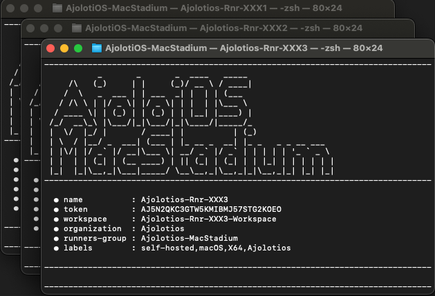
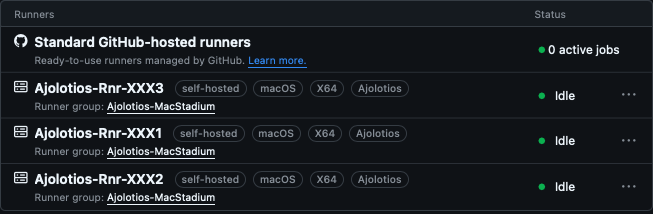

## [⬅️](./../README.md) Script Manual

### 1) Navigate to AjolotiOS-MacStadium folder

```terminal
► cd AjolotiOS-MacStadium; ls -la
```

```terminal
total 24
drwxr-xr-x@ 11 user  staff  352 Jan 01 00:01 .
drwxr-xr-x   5 user  staff  160 Jan 01 00:01 ..
drwxr-xr-x   2 user  staff   64 Jan 01 00:01 .doc
drwxr-xr-x  18 user  staff  576 Jan 01 00:01 .git
-rw-r--r--   1 user  staff   51 Jan 01 00:01 .gitignore
-rw-r--r--   1 user  staff  462 Jan 01 00:01 README.md
-rwxr-xr-x   1 user  staff  515 Jan 01 00:01 StartRunner.sh
-rwxr-xr-x   1 user  staff  515 Jan 01 00:01 StartRunners.sh
drwxr-xr-x   4 user  staff  128 Jan 01 00:01 src
```
### 2.A) Execute StartRunner.sh for one single runner

- **_TOKEN_**: Follow [Token Manual](./manual_token.md) to get this value

- **_RUNNER_ID_**: an string with format '_XXXX_' 

```terminal
► ./StartRunner.sh <TOKEN> <RUNNER_ID>
```

### 2.B) Execute StartRunners.sh  for multiple runners
This script does not requires parameters, information will be extracted from .env file
```terminal
► ./StartRunners.sh
```
If  .env files does not exist a template will be created for you when below message is showed. 

Follow [.env Manual](manual_env.md) instructions.

```terminal
	❌ Missing .env file

	 File .env was created for you,
	 please fill it with your information
```


Once .env is ready, run the script again, each runner will be executed in a independet window.



### 3) Press Enter or change the _work folder name

Each runner workspace will be located in runners directory, if script is executed for existing runner ID, the workspace will be recreated again
```terminal
.
├── LICENSE
├── README.md
├── StartRunner.sh
├── StartRunners.sh
├── doc
├── downloads
├── runners
│   ├── Ajolotios-Rnr-XXX1-Workspace ⬅️
│   ├── Ajolotios-Rnr-XXX2-Workspace ⬅️
│   └── Ajolotios-Rnr-XXX3-Workspace ⬅️
└── src
```

### 4) Your are done, runner is waiting for Jobs (Idle status)



