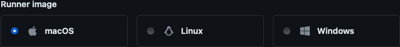
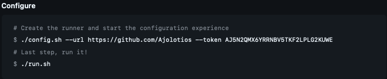

## [⬅️](./../README.md) Token Manual

### 1) Open [Runners/Create self-hosted runner](https://github.com/organizations/Ajolotios/settings/actions/runners/new) and select macOS Runner Image 



### 2) Copy the value after '_--token_' argument



### 3a) Execute _StartRunner.sh_ script with this token to create one single runner
```terminal
► ./StartRunner.sh AJ5N2QMX6YRRNBV5TKF2LPLG2KUWE <RUNNER_ID>
```

### 3b) replace XXXXXXXXXXXXXXXXXXXXXXXXXXXXX with this token in _.env_ file to create multiple runners
```terminal
ENV_TOKEN=AJ5N2QMX6YRRNBV5TKF2LPLG2KUWE
ENV_RUNNERS_ID="XXX1 XXX2 XXX3"
```

